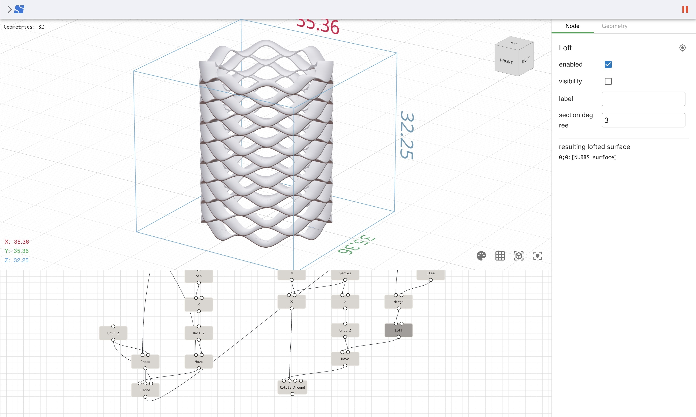

   <h1 style="display: inline; font-size: 20px;">Nodi v2 early access</H1>

https://v2.nodi3d.com

Version 2 is being developed as a rework of [version 1](https://nodi3d.com), and while many features are still under development, it is available as an early access version.

This repository serves as a platform for documentation and community discussions.

Please note that the source code for this version is not publicly available,
but feedback and questions are welcome as we continue development.

## Documentation

Documentation is available at [Wiki](https://github.com/Nodi3d/nodi-v2/wiki) tab.

## Questions and feedback

Please use the [Discussions](https://github.com/Nodi3d/nodi-v2/discussions) tab to ask questions, share ideas, and discuss anything related to Nodi v2.

## Author

[Masatatsu Nakamura](https://mattatz.org)
